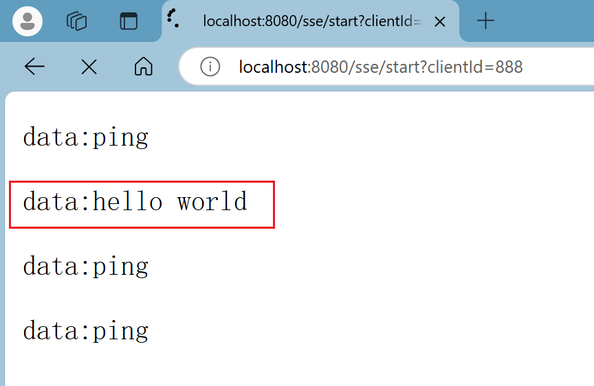

# SSE协议 Springboot开发实践

## 1. SSE 协议

SSE（Service-sent event）协议实现，SSE 协议是 HTTP 协议的一种，服务端可以主动向客户端推送消息，服务端向客户端单向推送数据。

SSE 协议用于服务器向客户端推送数据，是单向的、基于 HTTP 协议的长连接协议。

它的特点包括自动重连、事件分发机制等。

创建 SSE 非常简单，客户端只需创建 EventSource 实例并传入服务器 URL。

服务器需要**将 Content-Type 设置为 text/event-stream**，以确保浏览器识别为 SSE 流。

在 Spring 框架中，通过 SseEmitter 进行实现。

## 2. 开发实践

```text
.
├── README.md
├── pom.xml
└── src
    └── main
        ├── java
        │   └── cn
        │       └── zuster
        │           └── sse
        │               ├── SseApplication.java【启动类】
        │               ├── controller         【控制器】
        │               ├── exception          【异常】
        │               ├── service            【服务接口】
        │               │   └── impl           【服务实现】
        │               ├── session            【SESSION管理】
        │               └── task               【任务管理】
        └── resources
            └── application.properties         【配置文件】

```


建立连接：


服务端向客户端发送消息：





## 3. 测试

> 建立连接：http://localhost:8080/sse/start?clientId=888
> 关闭连接：http://localhost:8080/sse/end?clientId=111